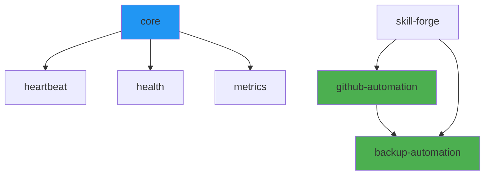

# Skill Health Dashboard

> Überwachung aller Skills und ihrer Abhängigkeiten  
> Status, Metriken, Alerts

---

## Überblick

### Was wird überwacht?

| Aspekt | Metrik | Frequenz |
|--------|--------|----------|
| SKILL.md Existenz | Binary | Täglich |
| Scripts ausführbar | Binary | Täglich |
| Dependencies verfügbar | Binary | Täglich |
| Letzte Ausführung | Timestamp | Pro Aufruf |
| Fehler-Rate | Counter | Kontinuierlich |

---

## Skill Health Check

### Master Script

```bash
#!/bin/bash
# /home/steges/scripts/skill-health-master.sh

SKILL_DIR="/home/steges/agent/skills"
STATE_DIR="$SKILL_DIR/.state"
REPORT_FILE="$STATE_DIR/skill-health.json"

HEALTHY=0
UNHEALTHY=0

# Array für Report
declare -a RESULTS

check_skill() {
    local skill_path=$1
    local skill_name=$(basename "$skill_path")
    local status="healthy"
    local issues=""
    
    # 1. SKILL.md existiert?
    if [[ ! -f "$skill_path/SKILL.md" ]]; then
        status="unhealthy"
        issues="Missing SKILL.md"
    fi
    
    # 2. Scripts-Verzeichnis?
    if [[ -d "$skill_path/scripts" ]]; then
        local non_executable=0
        for script in "$skill_path/scripts/"*.sh; do
            [[ -f "$script" ]] && [[ ! -x "$script" ]] && ((non_executable++))
        done
        if [[ $non_executable -gt 0 ]]; then
            status="warning"
            issues="$issues; $non_executable scripts not executable"
        fi
    fi
    
    # 3. Dependencies prüfen
    if [[ -f "$skill_path/SKILL.md" ]]; then
        local deps=$(grep "dependencies:" "$skill_path/SKILL.md" | sed 's/.*\[\(.*\)\].*/\1/' | tr ',' '\n')
        for dep in $deps; do
            dep=$(echo "$dep" | xargs | tr -d '"')
            # Skip system packages
            [[ "$dep" =~ ^(git|rsync|jq|curl|docker|mount|gh)$ ]] && continue
            
            if [[ ! -d "$SKILL_DIR/$dep" ]]; then
                status="unhealthy"
                issues="$issues; Missing dependency: $dep"
            fi
        done
    fi
    
    # 4. State-Verzeichnis?
    if [[ ! -d "$skill_path/.state" ]]; then
        # Nicht kritisch, nur Info
        :  # no-op
    fi
    
    # Ergebnis speichern
    if [[ "$status" == "healthy" ]]; then
        ((HEALTHY++))
    else
        ((UNHEALTHY++))
    fi
    
    # JSON-Entry
    RESULTS+=("{\"name\": \"$skill_name\", \"status\": \"$status\", \"issues\": \"$issues\"}")
}

# Alle Skills prüfen
for skill in "$SKILL_DIR"/*/; do
    [[ -d "$skill" ]] && check_skill "$skill"
done

# Report generieren
mkdir -p "$STATE_DIR"

cat > "$REPORT_FILE" << EOF
{
  "timestamp": "$(date -Iseconds)",
  "summary": {
    "total": $((HEALTHY + UNHEALTHY)),
    "healthy": $HEALTHY,
    "unhealthy": $UNHEALTHY,
    "health_percentage": $(( HEALTHY * 100 / (HEALTHY + UNHEALTHY) ))
  },
  "skills": [
$(IFS=,; echo "${RESULTS[*]}")
  ]
}
EOF

echo "Health Check Complete:"
echo "  Healthy:   $HEALTHY"
echo "  Unhealthy: $UNHEALTHY"

exit $UNHEALTHY
```

---

## Prometheus Integration

### Metrics Export

```bash
#!/bin/bash
# skill-metrics-exporter.sh

TEXTFILE_DIR="/var/lib/node_exporter/textfile_collector"
REPORT_FILE="/home/steges/agent/skills/.state/skill-health.json"

if [[ -f "$REPORT_FILE" ]]; then
    total=$(jq '.summary.total' "$REPORT_FILE")
    healthy=$(jq '.summary.healthy' "$REPORT_FILE")
    unhealthy=$(jq '.summary.unhealthy' "$REPORT_FILE")
    
    cat << EOF > "$TEXTFILE_DIR/skills.prom.$$"
# HELP skills_total Total number of skills
# TYPE skills_total gauge
skills_total $total

# HELP skills_healthy Number of healthy skills
# TYPE skills_healthy gauge
skills_healthy $healthy

# HELP skills_unhealthy Number of unhealthy skills
# TYPE skills_unhealthy gauge
skills_unhealthy $unhealthy

# HELP skills_health_percentage Percentage of healthy skills
# TYPE skills_health_percentage gauge
skills_health_percentage $(( healthy * 100 / total ))
EOF
    
    # Per-Skill metrics
    jq -c '.skills[]' "$REPORT_FILE" | while read skill; do
        name=$(echo "$skill" | jq -r '.name')
        status=$(echo "$skill" | jq -r '.status')
        
        # 1 for healthy, 0 for unhealthy/warning
        value=0
        [[ "$status" == "healthy" ]] && value=1
        
        echo "skills_health{name=\"$name\"} $value" >> "$TEXTFILE_DIR/skills.prom.$$"
    done
    
    mv "$TEXTFILE_DIR/skills.prom.$$" "$TEXTFILE_DIR/skills.prom"
fi
```

### Alert Rules

```yaml
# /home/steges/monitoring/alert-rules/skills.yml
groups:
  - name: skills
    rules:
      - alert: SkillsUnhealthy
        expr: skills_unhealthy > 0
        for: 5m
        labels:
          severity: warning
        annotations:
          summary: "{{ $value }} skills are unhealthy"
          description: "Check skill health dashboard"

      - alert: SkillHealthLow
        expr: skills_health_percentage < 80
        for: 10m
        labels:
          severity: critical
        annotations:
          summary: "Only {{ $value }}% of skills are healthy"

      - alert: SkillDependencyMissing
        expr: |
          count(
            skills_health{name=~"backup-automation|other-skill"} == 0
          ) > 0
        for: 5m
        labels:
          severity: warning
        annotations:
          summary: "Critical skill dependencies missing"
```

---

## Grafana Dashboard

### Panels

#### 1. Overall Health Gauge

```json
{
  "title": "Skills Health",
  "type": "gauge",
  "targets": [
    {
      "expr": "skills_health_percentage",
      "legendFormat": "Health %"
    }
  ],
  "fieldConfig": {
    "min": 0,
    "max": 100,
    "thresholds": {
      "steps": [
        {"color": "red", "value": 0},
        {"color": "yellow", "value": 70},
        {"color": "green", "value": 90}
      ]
    },
    "unit": "percent"
  }
}
```

#### 2. Skills by Status

```json
{
  "title": "Skill Status Distribution",
  "type": "piechart",
  "targets": [
    {
      "expr": "sum by (status) (skills_health)",
      "legendFormat": "{{status}}"
    }
  ]
}
```

#### 3. Individual Skill Table

```json
{
  "title": "Skill Details",
  "type": "table",
  "targets": [
    {
      "expr": "skills_health",
      "format": "table",
      "instant": true
    }
  ],
  "transformations": [
    {
      "id": "organize",
      "options": {
        "renameByName": {
          "name": "Skill",
          "Value": "Health"
        }
      }
    }
  ]
}
```

---

## CLI Dashboard

### Real-Time Anzeige

```bash
#!/bin/bash
# skill-dashboard.sh

SKILL_DIR="/home/steges/agent/skills"

# Farben
GREEN='\033[0;32m'
RED='\033[0;31m'
YELLOW='\033[1;33m'
NC='\033[0m'

clear
echo "╔══════════════════════════════════════════════════════════╗"
echo "║              SKILL HEALTH DASHBOARD                      ║"
echo "╠══════════════════════════════════════════════════════════╣"
printf "║ %-20s │ %-10s │ %-25s ║\n" "Skill" "Status" "Details"
echo "╠══════════════════════════════════════════════════════════╣"

for skill in "$SKILL_DIR"/*/; do
    name=$(basename "$skill")
    status="${GREEN}OK${NC}"
    details=""
    
    # Check SKILL.md
    if [[ ! -f "$skill/SKILL.md" ]]; then
        status="${RED}ERR${NC}"
        details="No SKILL.md"
    fi
    
    # Check scripts executable
    if [[ -d "$skill/scripts" ]]; then
        non_exec=$(find "$skill/scripts" -name "*.sh" ! -perm /111 2>/dev/null | wc -l)
        if [[ $non_exec -gt 0 ]]; then
            status="${YELLOW}WARN${NC}"
            details="$non_exec not exec"
        fi
    fi
    
    # Check dependencies
    if [[ -f "$skill/SKILL.md" ]]; then
        deps=$(grep "dependencies:" "$skill/SKILL.md" | sed 's/.*\[\(.*\)\].*/\1/' 2>/dev/null)
        if [[ -n "$deps" ]]; then
            # Zeige nur dass es deps gibt
            details="deps: ${deps:0:20}..."
        fi
    fi
    
    printf "║ %-20s │ %b%-10s%b │ %-25s ║\n" \
        "$name" "" "$status" "" "$details"
done

echo "╚══════════════════════════════════════════════════════════╝"
echo ""
echo "Total: $(ls -d "$SKILL_DIR"/*/ 2>/dev/null | wc -l) skills"
echo "Checked: $(date '+%Y-%m-%d %H:%M:%S')"
```

---

## Dependency Graph Visualization

### Mermaid-Diagram

```markdown

```

### In Grafana (mit Node Graph Panel)

```json
{
  "title": "Skill Dependencies",
  "type": "nodeGraph",
  "datasource": "prometheus",
  "targets": [
    {
      "expr": "skills_health",
      "format": "table"
    }
  ]
}
```

---

## Alerting

### Critical Skills

```bash
# Diese Skills sind kritisch:
CRITICAL_SKILLS=(
    "backup-automation"
    "github-automation"
    "health"
    "heartbeat"
)

for skill in "${CRITICAL_SKILLS[@]}"; do
    if [[ ! -d "/home/steges/agent/skills/$skill" ]]; then
        /home/steges/scripts/claw-send.sh "🚨 Critical skill missing: $skill"
    fi
done
```

### Recovery Alerts

```bash
# Wenn Skill wieder gesund:
if skill_was_unhealthy && skill_now_healthy; then
    /home/steges/scripts/claw-send.sh "✅ Skill recovered: $skill_name"
fi
```

---

## Integration mit Heartbeat

```bash
# HEARTBEAT.md Eintrag:

## Skill Health Check

- [ ] Check: /home/steges/scripts/skill-health-master.sh
- [ ] Frequenz: Jeder 4. Heartbeat
- [ ] Action bei Fehlern: claw-send.sh Benachrichtigung

## Befehl
```bash
/home/steges/agent/skills/.state/skill-health.json anzeigen
```
```

---

## Automatische Reparatur (Optional)

```bash
#!/bin/bash
# skill-auto-repair.sh

SKILL_DIR="/home/steges/agent/skills"

# Nicht-ausführbare Scripts fixen
for script in "$SKILL_DIR"/*/scripts/*.sh; do
    if [[ -f "$script" ]] && [[ ! -x "$script" ]]; then
        echo "Fixing permissions: $script"
        chmod +x "$script"
    fi
done

# Fehlende .state Verzeichnisse erstellen
for skill in "$SKILL_DIR"/*/; do
    if [[ ! -d "$skill/.state" ]]; then
        echo "Creating .state for: $(basename $skill)"
        mkdir -p "$skill/.state"
        touch "$skill/.state/.gitkeep"
    fi
done

echo "Auto-repair complete"
```

---

## Verweise

- `docs/infrastructure/skill-dependencies.md` – Dependency-Graph
- `docs/runbooks/skill-dependency-check.md` – Troubleshooting
- `docs/monitoring/backup-monitoring.md` – Backup-Monitoring
